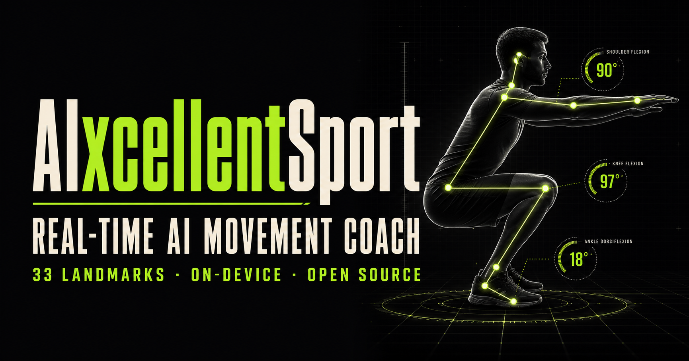

# AIxcellentSport



> Your form, understood. An open-source, on-device AI movement coach.

AIxcellentSport turns a laptop camera into a real-time training partner. It detects 33 body landmarks in the browser, measures joint angles, counts repetitions, and translates movement patterns into concise coaching cues.

This repository is the software-first continuation of the original **Aixcellent Sports** intelligent visual sport evaluation concept. It keeps the earlier project's real-time correction, personalized guidance, and skeletal-motion visual identity, while making the first open-source version usable with an ordinary browser and camera.

## Why this project

Most fitness apps count time or reps. AIxcellentSport focuses on **how a movement is performed** while keeping raw video on the user's device.

## Current MVP

- Real-time browser camera input
- On-device pose detection with MediaPipe Pose Landmarker
- Landmark and skeleton overlay
- Exercise-specific rep counting for squats, push-ups, and jumping jacks
- Joint-angle, symmetry, and movement-quality scoring
- Coaching cues for knee valgus, body-line stability, and range of motion
- Responsive Chinese product interface

## Quick start

Requirements: Node.js 22.13+

```bash
npm install
npm run dev
```

Open the local URL, choose an exercise, and allow camera access. The model and WebAssembly runtime are loaded on first use.

## How it works

1. MediaPipe identifies 33 normalized body landmarks from each camera frame.
2. Exercise rules calculate joint angles and identify movement phases.
3. A small state machine counts full repetitions and detects common compensation patterns.
4. The UI renders feedback without uploading video frames to a server.

The first version intentionally uses explainable geometric rules. A future classifier can learn temporal movement embeddings while keeping the current rules as interpretable safety checks.

## Roadmap

- [ ] Web Worker inference pipeline
- [ ] More exercise profiles and side-view calibration
- [ ] Session history and progress trends
- [ ] User-calibrated range-of-motion targets
- [ ] Temporal model for movement quality classification
- [ ] Community exercise-rule SDK

## Privacy and safety

Camera frames are processed locally in the browser and are not uploaded by this project. Feedback is intended for general fitness education and is not a medical diagnosis or a substitute for a qualified coach or clinician.

Published accuracy claims must be backed by a reproducible dataset, protocol, and evaluation report. Historical concept-deck metrics are not treated as current MVP results.

## Contributing

Issues, exercise rules, accessibility improvements, and model optimizations are welcome. Please open an issue describing the movement, camera angle, expected signal, and a reproducible test case.

## License

MIT
